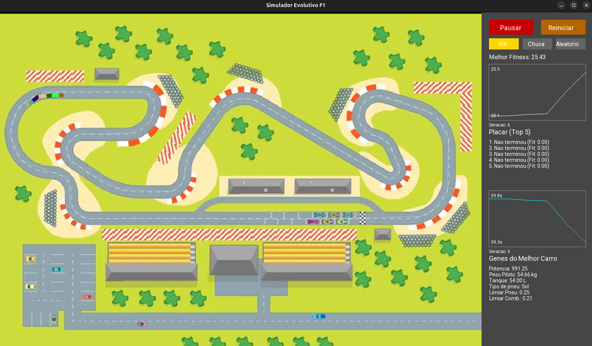

# Simulador de Otimização de Carros com Algoritmos Evolutivos



## 🎯 Objetivo

Este projeto utiliza um algoritmo genético para otimizar os parâmetros de carros de corrida em um simulador 2D. O objetivo é encontrar a melhor combinação de "genes" (potência, peso, tipo de pneu, etc.) para que os carros completem um percurso no menor tempo possível, adaptando-se a diferentes condições, como o clima.

Este trabalho foi desenvolvido como projeto final da disciplina SSC0713 - Sistemas Evolutivos Aplicados à Robótica, ministrada pelo Prof. Dr. Eduardo do Valle Simões.

## ✨ Funcionalidades Principais

O simulador implementa um ecossistema completo de evolução e simulação:

  * **Simulação de Corrida 2D:** Vinte carros competem em uma pista 2D com *waypoints* customizáveis, simulando 2 voltas por geração.
  * **Física Simplificada:** O desempenho dos carros é afetado por seus genes e por condições externas, incluindo:
      * Potência do Motor vs. Consumo de Combustível.
      * Peso do Piloto.
      * Atrito dos Pneus (Sol, Chuva, Híbrido) vs. Clima.
  * **Algoritmo Genético Avançado:**
      * **Elitismo:** O "Top 5" de cada geração sobrevive e se torna pai. O melhor de todos é 100% preservado.
      * **Crossover Ponderado:** Os pais com melhor fitness (2º ao 5º lugar) têm mais influência genética na geração dos filhos.
      * **Mutação Dinâmica:** A taxa de mutação dos novos filhos aumenta automaticamente se o algoritmo detecta estagnação (o melhor carro não muda por várias gerações), forçando a busca por novas soluções.
  * **Interface Gráfica (UI) Interativa:**
      * Painel de controle em tempo real construído com **SFML**.
      * **Gráfico de Fitness:** Mostra o melhor fitness de todos os tempos (eixo Y) por geração (eixo X).
      * **Gráfico de Tempo:** Mostra o tempo do melhor carro (eixo Y) por geração (eixo X), permitindo visualizar a queda no tempo de volta.
      * **Controle de Clima:** Botões para definir o clima da corrida como Sol, Chuva ou Aleatório (que pode mudar durante a corrida).
      * **Placar e Genes:** Exibe o placar "Top 5" (com tempo e fitness) e os genes do melhor carro da simulação.

## 🛠️ Tecnologias Utilizadas

  * **C++ (Padrão 17):** Linguagem principal do projeto.
  * **SFML (v2.6):** Biblioteca de multimídia utilizada para toda a renderização gráfica, janelas e interface do usuário (UI).
  * **CMake:** Utilizado para gerenciar a compilação do projeto de forma multiplataforma.

-----

## 🚀 Como Executar o Projeto

Existem duas maneiras de executar o simulador: compilando a partir do código-fonte (Linux) ou baixando o executável pronto (Windows).

### 🐧 Linux (Para Desenvolvedores/Compilando)

Estas instruções são para sistemas baseados em Ubuntu/Debian e permitem compilar o projeto do zero.

**1. Instalar as Dependências:**
Um script de conveniência é fornecido para instalar todas as ferramentas e bibliotecas necessárias (`g++`, `cmake`, `git` e `libsfml-dev`).

Primeiro, torne o script executável:

```bash
chmod +x setup.sh
```

Depois, execute-o:

```bash
./setup.sh
```

**2. Compilar o Projeto:**
Com as dependências instaladas, use o CMake para compilar o projeto. O `libsfml-dev` será encontrado automaticamente.

```bash
cmake -B build -S . && cmake --build build
```

**3. Executar o Simulador:**
O executável será criado dentro da pasta `build`.

```bash
./build/BEST-CAR-SIMULATOR
```

### 🪟 Windows (Público Geral / Executável)

*(Sugestão: Para que esta seção funcione, você precisaria compilar o projeto no Windows uma vez e enviar o `.exe` e as `.dll` necessárias para a seção "Releases" do seu GitHub.)*

1.  Vá até a seção **[Releases](https://www.google.com/search?q=https://github.com/seu-usuario/Simulador-melhor-carro/releases)** deste repositório.
2.  Baixe o arquivo `Simulador-F1-Windows.zip`.
3.  Descompacte a pasta em qualquer local.
4.  Execute o arquivo `BEST-CAR-SIMULATOR.exe`.